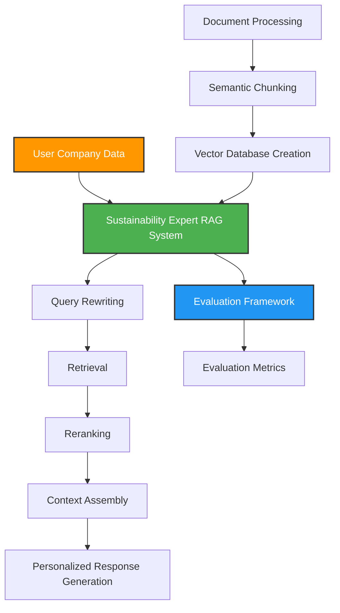

# 🌿 Raylow: AI-Powered CSRD Compliance Assistant 🌿


<br>

## 🔍 Overview

Raylow is an intelligent, user-friendly platform designed to revolutionize corporate sustainability reporting through AI. Our initial focus is the European Corporate Sustainability Reporting Directive (CSRD), helping companies navigate complex regulatory requirements with minimal resource drain.

This project implements a Retrieval-Augmented Generation (RAG) system that leverages Large Language Models (LLMs) to provide accurate, context-aware responses to sustainability reporting questions. By combining the power of semantic search with advanced re-ranking algorithms, Raylow delivers precise guidance on CSRD compliance.

<br>

## Problem Statement

Environmental regulations are becoming mandatory for more companies and are notoriously difficult to navigate. Key challenges include:

- Complex, evolving regulatory frameworks with technical jargon
- Resource-intensive data collection and validation processes
- Limited in-house expertise for interpreting requirements
- Disproportionate burden on SMEs without dedicated sustainability teams

<br>

## ✨ Features

- **🔄 Intelligent Query Processing**: Rewrites user questions to optimize retrieval of relevant information
- **🧩 Semantic Document Chunking**: Breaks documents into meaningful segments preserving context
- **🔎 Advanced Retrieval**: Combines vector search with cross-encoder re-ranking for accurate context retrieval
- **🤖 LLM Integration**: Interfaces with state-of-the-art models from Mistral AI and Cohere
- **📊 Comprehensive Evaluation**: Robust metrics for assessing system performance and accuracy
- **⚡ Streaming Responses**: Real-time generation of answers for interactive user experience

<br>

## 🏗️ RAG Architecture



<br>

### 🔄 RAG Pipeline in Detail

1. **📄 Document Processing**
   - Load PDF documents containing regulations using Docling
   - Convert to text and create Document objects with metadata
   - Process both official EU CSRD directives and supplementary guides

<br>

2. **✂️ Semantic Chunking**
   - Split documents into semantically meaningful segments using:
     ```python
     text_parser = SemanticSplitterNodeParser(
         buffer_size=1, 
         breakpoint_percentile_threshold=80, 
         embed_model=embed_model
     )
     ```
   - Parameter `breakpoint_percentile_threshold=80` controls chunk boundaries based on semantic shifts
   - Generates ~250 chunks from CSRD documents with natural semantic boundaries

<br>

3. **🧠 Vector Database Creation**
   - Create embeddings for each chunk using HuggingFaceEmbedding
   - Build FAISS vector store for efficient similarity search
   - Persist to disk for reuse with `storage_context.persist()`

<br>

4. **🌱 SustainabilityExpert RAG System**
   - Load vector store and configure retriever with top-k=10
   - Implement cross-encoder reranking with MS-MARCO MiniLM model
   - Configure LLM client (Mistral/Cohere) for response generation
   - Track token usage and implement streaming for responsive UI

<br>

5. **🔄 Query Pipeline**
   - **✏️ Query Rewriting**: Enhance original query to better target relevant information
   - **🔍 Retrieval**: Get top-k chunks based on embedding similarity
   - **⚖️ Reranking**: Apply cross-encoder to select top 4 most relevant chunks
   - **📚 Context Assembly**: Combine chunks into a coherent context window
   - **💬 Response Generation**: Generate a comprehensive answer using the LLM

<br>

## 📊 Evaluation Framework

The system includes a comprehensive evaluation framework based on the RAGAS library with metrics across several dimensions:

<br>

### 📚 Context Quality
- **📋 Context Recall**: Measures how many relevant documents are successfully retrieved (0-1)
- **🎯 Context Precision**: Evaluates what proportion of retrieved chunks are actually relevant (0-1)
- **🔄 Context Relevance**: Assesses alignment between retrieved passages and the query, using dual LLM judges

<br>

### 💬 Response Quality
- **✓ Faithfulness**: Measures factual consistency of responses with the retrieved contexts
- **🎯 Response Relevancy**: Evaluates how well the response addresses the original question
- **🏗️ Response Groundedness**: Assesses whether each claim in the response is supported by the context

<br>

### 🎖️ Accuracy
- **⭐ Answer Accuracy**: Measures agreement between model's response and reference ground truth using two independent LLM judges on a 0-4 scale

<br>

## ⚡ Response Time Optimization

We initially started with an 'Adaptive RAG' architecture (collaboration between Mistral and Langchain), but found response times of 45-55 seconds were too slow for practical use. By redesigning our architecture from scratch with simplicity and optimization in mind, we achieved response times of 4-10 seconds.

Key improvements:
- Streamlined component architecture
- Implemented streaming responses for immediate feedback
- Optimized retrieval and reranking processes
- Balanced sophistication with performance

This approach creates a pleasant user experience while maintaining high-quality responses.

<br>

## 💾 Installation & Setup

1. Clone the repository:
   ```bash
   git clone https://github.com/username/Raylow.git
   cd Raylow
   ```

2. Install dependencies:
   ```bash
   pip install -r requirements.txt
   ```

3. Set up environment variables:
   ```
   MISTRAL_API_KEY=your_mistral_api_key
   COHERE_API_KEY=your_cohere_api_key
   OPENAI_API_KEY=your_openai_api_key  # For evaluation
   ```

4. Run the Jupyter notebooks:
   - `Llama_index_RAG.ipynb`: Process documents and build the vector store
   - `Sustainability_expert.ipynb`: Access the RAG system for CSRD queries
   - `RAG_Eval.ipynb`: Evaluate the system performance

<br>

## 📊 Model Performance

The system has been tested with multiple LLMs, with performance metrics shown below:

| Model | Context Recall | Faithfulness | Context Precision | Response Relevancy | Response Groundedness | Context Relevance | Answer Accuracy |
|-------|----------------|--------------|-------------------|--------------------|-----------------------|-------------------|-----------------|
| Mistral Large 24.11 | 0.6860 | 0.8486 | 0.9002 | 0.7931 | 0.9259 | 0.9423 | 0.8190 |
| Mistral Small 3.1 | 0.7115 | 0.8812 | 0.8702 | 0.7586 | 0.9730 | 0.9107 | 0.8125 |
| Qwen 72B | 0.6591 | 0.8733 | 0.9178 | 0.7123 | 1.0000 | 1.0000 | 0.7915 |
| Command-r-08-20 | 0.6922 | 0.7546 | 0.8572 | 0.3694 | 0.9146 | 0.8520 | 0.6350 |

We selected **Mistral Small 3.1** for our production system as it offers the best balance between response quality and speed, delivering results similar to larger models but with significantly faster response times.

<br>

## 🔮 Future Development

- 🌍 Expand to other EU regulations (AI Act, GDPR, Digital Services Act)
- 📈 Implement dashboard for tracking compliance progress
- 📊 Add predictive analytics for sustainability metrics
- 🧠 Develop fine-tuned models specific to regulatory text
- 📝 Create automated report generation functionality
- 🌐 Add multilingual capabilities for international users
- 👥 Enhance user feedback loops for continuous improvement

<br>

## 👥 About

This project is developed as part of a Bachelor of Data and Business Analytics capstone at IE University under the supervision of Prof. Rafael Ballester Ripoll. 

<br>

## ⚖️ License

This project is proprietary and confidential. © 2025 Louis Golding, IE University.

<br>

## 🙏 Acknowledgements

Special thanks to all the ESG experts and professionals who provided valuable insights during the interview process, and to Dr. Robert Polding for guidance throughout the development of this concept.

<br>

---

*Raylow: Facilitating CSRD reporting for SMEs through AI-powered software*

